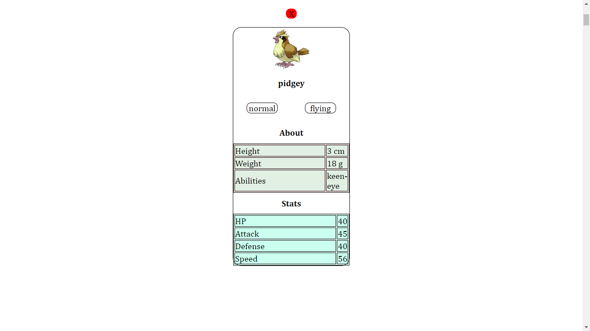

# Welcome to My Pokemon App
***

## Task
The task is to create a pokedex app. The pokedex app must render a home page that displays all pokemons and when clicked on a pokemon, it's details must be shown.

## Description
The app was created using React js and some dependecies. The app contains a folder Components. Inside it are all the different components that were used. There is a Body folder it contains the body(that is the container twhere is found all pokemons) and it's css. A Header folder that contains the file use to create the header and it's css. PokemonCard folder where is founc the file used to generate the card shown on the body and it's css. A PokemonDetail folder that is the file that is shown when clicked on a specific pokemon and it's css. A fetchAllPokemon.js that is used to fetch Pokemons

## Installation
The app is hosted online at
To run the code locally. download the source code, run "npm start" and go to localhost:8080

## Usage
Scroll down the page to see all Pokemons. Click on a pokemon to see it's details
The app also contains a search bar. Enter a name of a pokemon and it will fetch it

### The Core Team

<i>Made by <a href='https://www.linkedin.com/in/nuadje-todjo-dilan-wilfred-80b50b220/'>Nuadje Dilan</a></i>
 

